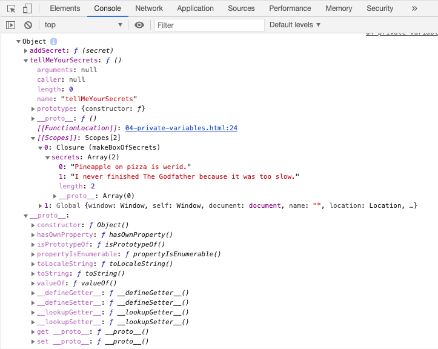

# Lesson Plan - Closures

## Overview

In this class, we will expand on our understanding of scope in the discussion of closures as a solution to some problems in programming, how to create them, and when should they be used or avoided.

## Assumptions

This lesson assumes the students have a strong understanding of defining and using their own functions, as well as a cursory knowledge of lexical scope.

By this point, students should be able to:

- Write JavaScript code in an HTML page using the `<script>` tag
- Use Chrome DevTools to view the output of the HTML page
- Define and use their own functions
- Define and use their own object literals
- Understand that variables created in higher scope are available in lower scopes
- Understand that variables created inside of functions are not accessible outside of them
- Manipulate HTML elements with the DOM API

`Summary: Complete activities 1-6 in activities folder`

## Instructor Notes

Today's class is focused on demonstrating closures. Reassure students that closures can be confusing at first, and that it may take them some time to fully wrap their heads around the concept.

Feel free to approach this lesson as a gentle exploration into the wild side of programming. Feel free to take additional time to explore edge-cases, and answer students' what-ifs.

## Learning Objectives

- To understand the problem that closures solve

- Implement closures to follow DRY principles

---

## Class Instruction

### 1. Instructor Do: Closure Intro (5-10 min)

- Open the file `01-intro.html` and ask the students to compare and contrast the two code blocks, then open the browser and show them the output.

- While the first block is cleaner, the secnd block uses closures and allows us to do some interesting things because it returns a function of it's own

### 2. Instructor Do: Closer look at Closures (10 min)

- Open the file `02-easy-closures.html` in the browser. Demonstrate to students how our closure approach can be implemented to re-use the last names for the "family" we're creating.

- If there's time it may be helpful to demonstrate how you would write out this code without the closure, highlighting how often we need to pass in the same strings.

### 3. Students Do: Closures and Cats (15 min)

- Proceed with the first activity, `03-cats-and-closure.html` in the `unsolved` folder in which you ask students to fill in the inner function that creates an object with a property defined from the outer function.

### 4. Instructor Do: Review Closures and Cats (5 min)

- Demonstrate solved solution from `03-cats-and-closure-solved.html` in the `solved` folder

- Summarize this activity by generalizing that closures are simply functions defined inside of functions.

**Note**: While it's tempting to call closures function factories or generators, we don't want to sully the student's GoogleFu and have them type in JS Generators or factories when trying to use closures, since those concepts open up a whole can of worms.

Focus on the concept of shared scope.

### 5. Instructor Do: "Private" Variables (15 min)

- Open the file `04-private-variables.html` and walk through the closure function with the class.

- Attempt to generate discussion on what the console would show in the example where we try to access variables in the outer function vs the inner functions.

- This should tie back to the discussion of lexical scope and not being able to access variables outside their functions.

**Important**:
Over-emphasize that when we say "private variables" in the realm of closures, we **DO NOT MEAN SECURE**.
Students should never put sensitive information in code that will be used in the browser.

- If you have time remaining you can demonstrate that these variables aren't totally private (and that we're in fact using closures) by calling `console.dir(mySecrets)` in the DevTools console and inspecting the `tellMeYourSecrets` method as shown here:

### 6. Student Do: Privates of the Carribean (20 min)

- Direct the students to `05-privates-of-the-caribbean.html` in the `unsolved` folder of `05-private-pirates.html` and ask the students to create their own closure function using private variables.

- This is going to challenge some students as it surreptitiously requires Object Oriented Programming skills they may not have learned yet, so be sure to check in with students periodically to drop hints or you can partially code-behind them if they get stuck.

### 7. Instructor Do: Private Variables Review (10 min)

- Open the solved solution from `05-privates-of-the-caribbean-solved.html` in the `solved` folder and demonstrate how we can use closure functions to build these "what-we-will-eventually-call-object-oriented-programming" objects.

- The key takeaway should be that you can enforce controlled get/set patterns by abstracting away from the variables themselves.
